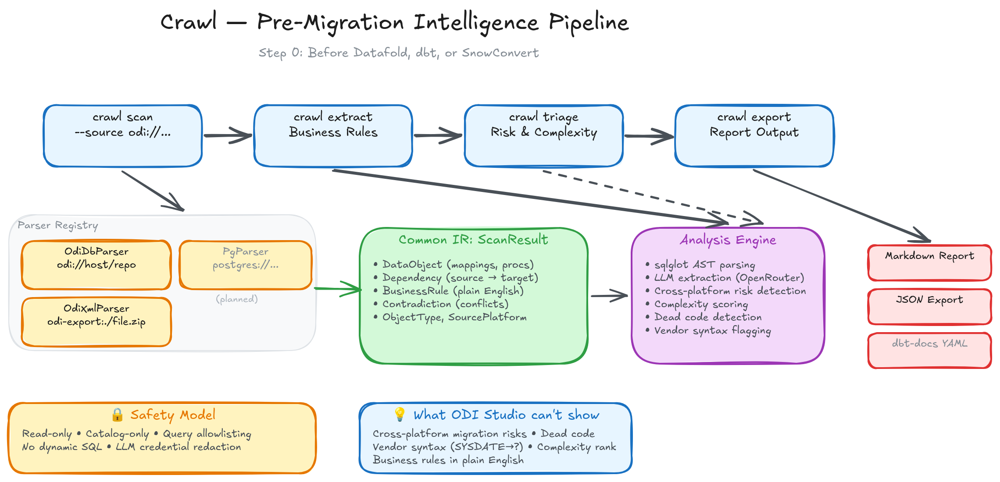
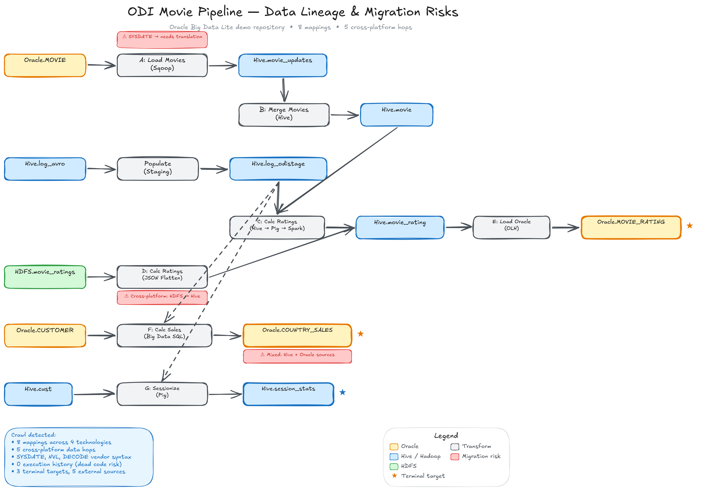

# Crawl

**Pre-migration intelligence for enterprise data infrastructure.**

Crawl extracts business logic from stored procedures, ETL jobs, and warehouse views — the undocumented rules buried in your data stack that block every migration project.

> They catalog your data. Crawl tells you what breaks when you migrate.

## The Problem

Every cloud migration hits the same wall: thousands of stored procedures and ETL jobs encoding business rules in vendor-specific dialects that nobody documented. Migration tools can *translate* your SQL, but they can't tell you what it *means* — or whether it's even still relevant.

Crawl is **Step 0**: the pre-migration intelligence layer that runs before you use Datafold, Lakebridge, dbt, or SnowConvert.

## Architecture



**Pipeline:** `scan → extract → triage → diff → export`

```
crawl scan     Connect to a source and discover all mappings, procs, views, dependencies
crawl extract  Extract human-readable business rules using hybrid AST + LLM analysis
crawl triage   Score each object by criticality, complexity, and migration risk
crawl diff     Compare extracted logic between environments or time periods
crawl export   Output to dbt-docs YAML, JSON, or Markdown
```

All parsers produce a **Common IR** (`ScanResult`) containing `DataObject`, `Dependency`, `BusinessRule`, and `Contradiction` records. Everything downstream of `scan` is source-agnostic.

The **Analysis Engine** combines deterministic AST parsing (via sqlglot) with LLM extraction (via OpenRouter) for business rule interpretation, cross-platform risk detection, complexity scoring, dead code flagging, and vendor syntax identification.

## Example: ODI Movie Pipeline

Crawl scanned a real Oracle Data Integrator repository (Oracle Big Data Lite demo) and produced this:



**What Crawl found that ODI Studio can't show you:**

- 8 mappings across 4 technologies (Oracle, Hive, Pig, Spark)
- 5 cross-platform data hops — each one a migration risk
- Vendor-specific syntax (`SYSDATE`, `NVL`, `DECODE`) that needs translation
- 0 execution history on any mapping — potential dead code
- 3 terminal targets, 5 external sources — data lineage boundaries

**Business rules extracted in plain English:**
```
C - Calc Ratings (Hive → Pig → Spark) (confidence: HIGH)
├── Rule: Calculates average movie ratings grouped by movie ID
├── Sources: HiveMovie.movie, HiveMovie.movieapp_log_odistage
├── Target: HiveMovie.movie_rating
└── Risk: ⚠️ Cross-platform hop (Hive → Pig → Spark) — vendor-specific aggregation

G - Sessionize Data (Pig) (confidence: HIGH)
├── Rule: Sessionizes click data, computes max/avg session duration by country
├── Expressions: ROUND(@{R0} * 1000), MAX(@{R0}), AVG(@{R0})
└── Risk: ⚠️ Pig Latin expressions need translation for target platform
```

## Design Principles

- **Step 0, not Step 1.** Crawl doesn't migrate your code — it tells you what you have so migration tools can do their job.
- **Vendor-neutral.** Works with any source database, any target platform. No lock-in.
- **Local-first LLM.** Enterprise code never needs to leave your environment. Supports Ollama and vLLM out of the box.
- **Open-source (Apache 2.0).** Your understanding of your data belongs to you, not a vendor.

## Supported Sources

| Source | Status | Mode |
|--------|--------|------|
| Oracle Data Integrator (ODI) | **Working** | Live DB (`odi://`) and offline XML Smart Export (`odi-export:`) |
| PostgreSQL stored procedures | Planned | |
| Snowflake (views, UDFs, procs, tasks) | Planned | |
| Informatica PowerCenter / IICS | Planned | |
| SQL Server stored procedures | Planned | |
| Oracle PL/SQL | Planned | |
| dbt models | Planned | |

### Dual Ingestion Modes (ODI)

The ODI parser supports two ways in:

- **Live DB mode** (`odi://host:1521/repo`) — connects read-only to the ODI repository database and queries SNP_ catalog tables directly
- **Offline export mode** (`odi-export:./export.zip`) — parses a Smart Export XML file. No database access needed. Critical for enterprise sales where DB access is restricted

## Safety Model

Crawl is designed to connect to enterprise databases safely. See [SAFETY.md](SAFETY.md) for the full safety model. Key guarantees:

- **Read-only, always.** No writes, no DDL, no DML. Read-only transaction mode enforced.
- **Catalog-only access.** Reads metadata from system catalogs (`pg_catalog`, `ALL_SOURCE`, `SNP_` tables). Never queries user table contents.
- **Query allowlisting.** Every SQL query is hardcoded and auditable. No dynamic SQL, no user-provided queries.
- **Non-production recommended.** Warns on production connection strings. Requires `--i-know-this-is-prod` to override.
- **No hammering.** Single connection, rate-limited, batched queries, configurable timeouts.
- **LLM redaction.** Credentials and connection strings stripped before sending source code to LLM.
- **Full audit trail.** Every LLM call logged to SQLite with model, tokens, timing, full request/response.

## Getting Started

```bash
# Install
pip install -e ".[dev,llm]"

# Scan an ODI Smart Export (no database access needed)
crawl scan --source "odi-export:./my-export.zip"

# Scan a live ODI repository
crawl scan --source "odi://host:1521/repo"

# Run tests
pytest
```

## Status

Pre-alpha. The ODI parser is working end-to-end with both live DB and offline XML modes. LLM business rule extraction, migration risk analysis, and visual lineage diagrams are functional. Additional parsers and CLI commands are in progress.

Star the repo to follow progress.

## License

Apache 2.0 — see [LICENSE](LICENSE).

## About

Built by [Digital Rain Technologies](https://digitalrain.studio). Founded by [Augustin Chan](https://augustinchan.dev), former Development Architect at Informatica (12 years, Fortune 500 data integration across APAC/MENA/Europe).

Part of the Digital Rain enterprise AI readiness platform, alongside [ARA-Eval](https://github.com/digital-rain-tech/ara-eval) (Agentic Readiness Assessment for regulated industries).
